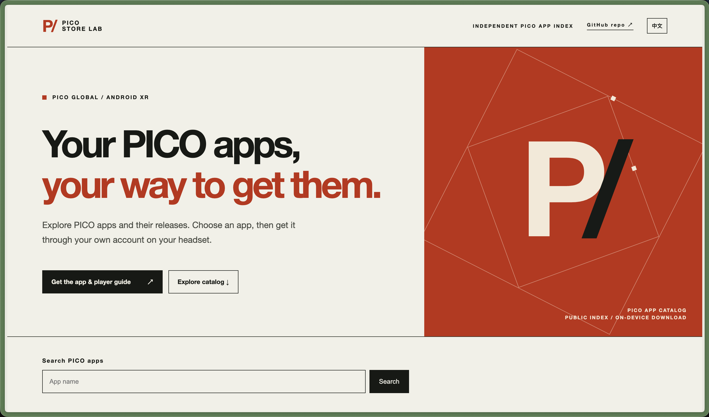
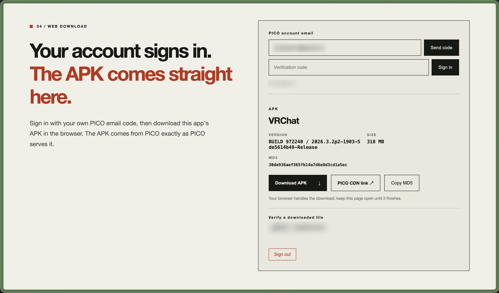

# PICO Store Lab

[](https://github.com/nkanf-dev/pico-store-lab/actions/workflows/ci.yml)
[](LICENSE)
[](https://github.com/nkanf-dev/pico-store-lab/releases)

[简体中文](README.zh-CN.md) · [Website](https://pico.kanglives.top/en/) · [Installation guide](https://pico.kanglives.top/en/guides/install-global-apps/) · [Download a client](https://pico.kanglives.top/en/download/)

Looking for VRChat or YouTube VR on a PICO headset with the China-region store? PICO Store Lab helps you find the PICO version, download it with your PICO international account, and install it without changing the headset's region.

Use the website to save an APK to your computer, or use the Android app to download and install on your headset.

**[VRChat for PICO](https://pico.kanglives.top/en/apps/vrchat/)** · **[YouTube VR for PICO](https://pico.kanglives.top/en/apps/youtube-vr/)** · [Browse all apps](https://pico.kanglives.top/en/)



<a id="player-guide"></a>
## Download and install

You’ll need a **PICO international account**. Don’t have one? [Register on PICO’s website](https://sso-global.picoxr.com/) by choosing **Sign Up**, then return here to sign in.

The [installation guide](https://pico.kanglives.top/en/guides/install-global-apps/) covers account registration, downloading, installing, and common questions. Check the supported devices on the app page before downloading. Each app has its own sign-in and network requirements.

App availability depends on your account’s region. For paid apps, purchase them in PICO Store before downloading.

### 1. Download from the website

1. Open the [VRChat](https://pico.kanglives.top/en/apps/vrchat/) or [YouTube VR](https://pico.kanglives.top/en/apps/youtube-vr/) page, or [search for another app](https://pico.kanglives.top/en/).
2. In **Web download**, enter your PICO account email, choose **Send code**, then enter the code from your inbox and choose **Sign in**.
3. For a free app you haven’t added to your account yet, choose **Get free app**.
4. Choose **Download APK**. Once it finishes, install the file on your headset using its APK installer or ADB.

If the email hasn’t arrived, check your spam folder and confirm you entered the email used for your PICO international account.



### 2. Download and install on your headset

Install PICO Store Lab on your headset once, then use it to find and install apps without a computer.

1. Download `pico-store-android.apk` from the [latest release](https://github.com/nkanf-dev/pico-store-lab/releases/latest). Open it with your headset’s APK installer, if available, or install it from a computer with ADB:

   ```sh
   adb devices                         # accept the USB debugging prompt in the headset
   adb install -r pico-store-android.apk
   ```

2. Open **PICO Store Lab** from **Unknown Sources** in your headset’s app library. The section name may vary by PICO OS version.
3. Search for an app and sign in using your PICO international account email and verification code.
4. Choose **Get** for a free app or **Download** for one you already own. When prompted, allow PICO Store Lab to install apps and confirm the installation.
5. For paid apps you don’t own yet, choose **View in PICO Store** to purchase them, then return to download.

### 3. Desktop app for Windows, macOS, and Linux

Download the installer for your computer and open **PICO Store Lab** to search, sign in, and download apps.

| System | x64 / Intel | ARM64 / Apple silicon |
| --- | --- | --- |
| Windows | [Windows x64](https://github.com/nkanf-dev/pico-store-lab/releases/latest/download/pico-store-desktop-windows-x64.exe) | [Windows ARM64](https://github.com/nkanf-dev/pico-store-lab/releases/latest/download/pico-store-desktop-windows-arm64.exe) |
| macOS | [macOS x64](https://github.com/nkanf-dev/pico-store-lab/releases/latest/download/pico-store-desktop-macos-x64.dmg) | [macOS ARM64](https://github.com/nkanf-dev/pico-store-lab/releases/latest/download/pico-store-desktop-macos-arm64.dmg) |
| Linux | [Linux x64](https://github.com/nkanf-dev/pico-store-lab/releases/latest/download/pico-store-desktop-linux-x64.AppImage) | [Linux ARM64](https://github.com/nkanf-dev/pico-store-lab/releases/latest/download/pico-store-desktop-linux-arm64.AppImage) |

- **Windows:** Run the installer, then open the app from the Start menu.
- **macOS:** Open the DMG and drag the app into Applications.
- **Linux:** Allow the AppImage to run as a program in its file properties, then double-click to open it.

Choose an app, sign in to your PICO international account, click **Download APK**, and choose a save location. Install the downloaded APK using your headset’s installer or ADB.

Use **Check for updates** in the desktop window or Android account menu to find a newer version.

### 4. Python command line

With Python 3.11 or later, install the CLI in a virtual environment. As above, replace the email and app details with your own choices.

```sh
python3 -m venv .venv
. .venv/bin/activate
python -m pip install pico-store-lab
pico-store-py search 'YouTube VR'
pico-store-py status --item-id 7270207384512020485 --package com.google.android.apps.youtube.vr.pico
pico-store-py send-code --email you@example.com
pico-store-py login --email you@example.com
pico-store-py download --item-id 7270207384512020485 --package com.google.android.apps.youtube.vr.pico --output ./selected-app.apk
pico-store-py logout
```

On Windows, activate the environment with `.venv\Scripts\Activate.ps1` instead. Choose a new output filename. After downloading, install the APK on your headset using its installer or `adb install -r ./selected-app.apk`. Run `pico-store-py --help` for more options.

## For developers

PICO Store Lab includes SDKs for searching apps, retrieving app details, email sign-in, and downloads. See each package’s README for examples and configuration.

| Component | Description | Install |
| --- | --- | --- |
| [TypeScript SDK](packages/ts/README.md) | Node.js client and the SDK used by the website | `npm install @nkanf-dev/pico-store-sdk` |
| [Python SDK](packages/python/README.md) | Python client and CLI | `pip install pico-store-lab` |
| [Rust SDK](packages/rust/README.md) | Rust client used by the desktop app | `cargo add pico-store-lab` |
| [Kotlin SDK](packages/kotlin/README.md) | Kotlin client used by the Android app | — |
| [Website](apps/website) | Chinese and English app catalog and web downloads | — |
| [Desktop app](apps/desktop-rs) | Native GPUI desktop app | `cargo install pico-store-desktop --locked` |
| [Android app](apps/android) | Browse, download, and install apps on a PICO headset | — |

### Local development

Clone the repository and run the commands for the component you want to work on:

```sh
git clone https://github.com/nkanf-dev/pico-store-lab.git
cd pico-store-lab

# TypeScript SDK and website — Node.js 25+
npm ci
npm run build:ts
node apps/website/src/dev.js                 # http://127.0.0.1:8787

# Python SDK — Python 3.11+
python3 -m pip install -e packages/python
pico-store-py --help

# Rust SDK and desktop app — Rust stable
cargo run -p pico-store-desktop

# Kotlin SDK and Android app — Java 17, Android SDK 37
cd apps/android
./gradlew assembleDebug
```

The Android build is saved to `apps/android/app/build/outputs/apk/debug/app-debug.apk`.

See [Contributing](CONTRIBUTING.md) for development and test instructions, [Releasing](RELEASING.md) for deployment and publishing, and [Security](SECURITY.md) to report a vulnerability.

## License

[MIT](LICENSE). PICO Store Lab is an independent community project and is not affiliated with PICO.
