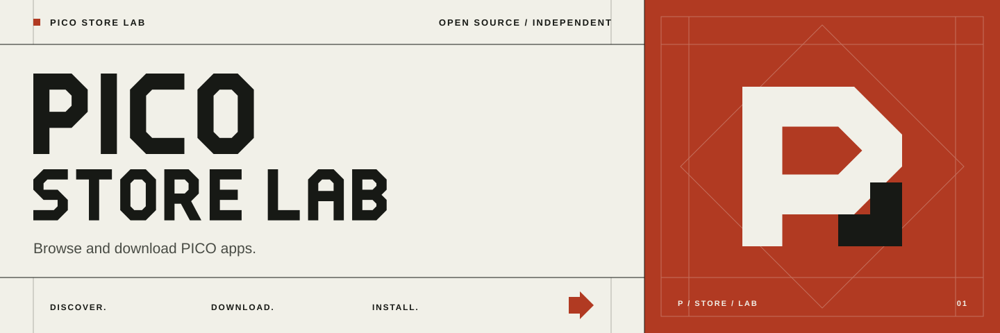
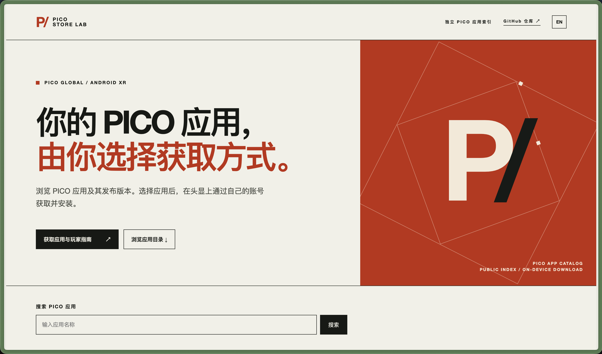
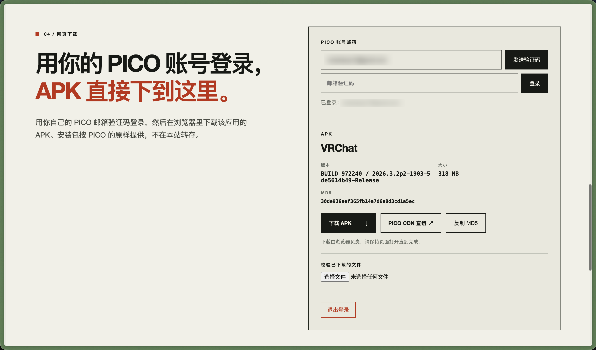

# PICO Store Lab

[](https://github.com/nkanf-dev/pico-store-lab/actions/workflows/ci.yml)
[](LICENSE)
[](https://github.com/nkanf-dev/pico-store-lab/releases)

[English](README.md) · [参与贡献](CONTRIBUTING.zh-CN.md) · [安全报告](SECURITY.md) · [发布流程](RELEASING.zh-CN.md)

独立的 PICO 应用目录与头显端安装客户端，同时为开发者提供可复用的 SDK。你可以浏览推荐、搜索 PICO 应用、查看版本，并用自己的 PICO 账号获取应用。本项目是独立社区项目。

在线浏览：**[pico.kanglives.top](https://pico.kanglives.top)**。公开网页提供应用发现、版本信息，并可在浏览器里直接下载 APK；头显客户端负责端内下载与安装。



<a id="player-guide"></a>
## 玩家指南：用自己的账号下载

你需要一个能够从对应地区 PICO 官方商店获取所选应用的账号。可先在网页浏览或搜索，再用自己的账号下载：支持网页下载、头显客户端，以及两种本机 CLI。

### 方案 A：在网页上下载 APK

在 [pico.kanglives.top](https://pico.kanglives.top) 打开 **04 / 网页下载**，用 PICO 邮箱验证码登录后点击**下载 APK**。只想要一个文件到电脑时，这条路径最短：

1. 填写账号邮箱，点击**发送验证码**，再填入邮件中的字母数字验证码并点击**登录**。
2. 如果账号尚未拥有可领取的免费应用，点击**获取应用并准备下载**后领取；仅浏览应用不会自动领取。确认拥有后，面板会显示 APK 版本、大小与 MD5。想用其他工具核对，可点击**复制 MD5**。
3. 点击**下载 APK**。浏览器按我们给出的文件名下载，面板会提示保持页面打开直到完成。
4. 想确认文件完整，在**校验已下载的文件**里选择该文件。它按 4 MiB 分片计算，几百 MB 的包也不会占满内存，结果与 PICO 给出的 MD5 比对。



你的 PICO 账号已拥有的应用都可在这里下载，包括付费应用。尚未拥有的付费应用及当前不可领取的商品，需要先通过官方商店获取。领取免费应用须明确触发同源 `POST /api/download/acquire`；下载与元数据 GET 接口不会领取应用。想拿 PICO 的原始直链就点 **PICO CDN 直链**，或者让 Worker 带着 MD5 响应头把文件流式传给你。两种方式均不将 APK 转存到存储桶。退出失败时，页面会提示会话可能仍有效，并允许重试。

### 方案 B：在头显上完成下载与安装

1. 从 [GitHub 最新 Release](https://github.com/nkanf-dev/pico-store-lab/releases/latest) 下载 `pico-store-android.apk`。头显打开 USB 调试并连接电脑后：

   ```sh
   adb devices                         # 在头显中同意 USB 调试授权
   adb install -r pico-store-android.apk
   ```

   如果你的 PICO 系统提供 APK 安装器，也可以在头显里打开下载好的文件；这条路径目前尚未实机验证。此 APK 为实验性调试签名版本，无法保证覆盖其他签名的安装版本。
2. 在头显应用库的**未知来源**或类似的非商店应用区域，打开 **PICO Store Lab**（入口名称因 PICO OS 版本而异）。浏览推荐或搜索应用，选择后查看官方版本；常用应用可以收藏。
3. 输入自己的 PICO 账号邮箱，点击**发送验证码**，填写邮件中的字母数字验证码，再点击**登录**。头显客户端把会话留在设备上，网页下载则把会话留在服务端；两者都不会保存密码。
4. 打开应用详情；免费应用点击**获取**，已拥有的应用点击**下载**。客户端先确认账号权益，需要时领取免费商品，权益生效后才下载到 `Download/PICO Store Lab`，并校验 APK 的 MD5、包名和版本，再打开 Android 安装器。若系统要求允许此来源安装，请允许 **PICO Store Lab**，然后重试并确认安装。
5. 尚未拥有的付费应用可点击**前往 PICO 商店**打开官方商品页；购买后返回客户端，确认账号已拥有该应用，再点击**下载**。

若官方接口提示账号地区无商品，请检查对应商品页和账号地区；客户端不能修改账号地区。项目作者已在 PICO 头显上验证 Android 客户端；本次新增修复仍需再次实机检查。

### 方案 C：在 macOS 用 Rust Desktop CLI 下载

从[同一个 Release](https://github.com/nkanf-dev/pico-store-lab/releases/latest)下载 `pico-store-desktop-macos-arm64`。先按名称搜索，再把结果中的精确 `itemId` 和 `packageName` 填入 `status` 和 `download`。下面以 YouTube VR 为例；选择其他应用时替换商品字段，邮箱也换成你自己的。`login` 会交互式询问邮件验证码。

```sh
chmod +x ./pico-store-desktop-macos-arm64
./pico-store-desktop-macos-arm64 search 'YouTube VR'
./pico-store-desktop-macos-arm64 status --item-id 7270207384512020485 --package com.google.android.apps.youtube.vr.pico
./pico-store-desktop-macos-arm64 send-code --email you@example.com
./pico-store-desktop-macos-arm64 login --email you@example.com --auth-file ./pico-auth.json
./pico-store-desktop-macos-arm64 download --item-id 7270207384512020485 --package com.google.android.apps.youtube.vr.pico --auth-file ./pico-auth.json --output ./selected-app.apk
adb install -r ./selected-app.apk          # 可选：头显已连接且允许 USB 调试
```

输出必须是尚不存在的 `.apk` 路径；CLI 校验官方 MD5 后才放到该路径。不要把 `pico-auth.json`、APK 或带签名的 CDN 链接上传到 Issue。若 macOS 阻止运行未签名 CLI，审查源码后可用 `cargo run -p pico-store-desktop -- ...` 自行编译运行。

### 方案 D：Python CLI

安装 Python 3.11+，在虚拟环境中从本仓库安装 Python 包。先用 `search` 找精确商品字段，再走同样的账号流程。输出路径请选择新的 `.apk` 文件，并确认磁盘空间足够。

```sh
python3 -m venv .venv
. .venv/bin/activate
python -m pip install 'git+https://github.com/nkanf-dev/pico-store-lab.git#subdirectory=packages/python'
pico-store-py search 'YouTube VR'
pico-store-py status --item-id 7270207384512020485 --package com.google.android.apps.youtube.vr.pico
pico-store-py send-code --email you@example.com
pico-store-py login --email you@example.com --auth-file ./pico-auth.json
pico-store-py download --item-id 7270207384512020485 --package com.google.android.apps.youtube.vr.pico --auth-file ./pico-auth.json --output ./selected-app.apk
```

桌面 CLI 会把包下载到电脑；再用 ADB 或头显支持的安装器安装。Android 头显客户端则在设备上完成下载，并请求系统确认安装。

## 仓库组成

| 组件 | 语言 | 用途 | 本版验证状态 |
| --- | --- | --- | --- |
| `packages/ts` | TypeScript | 商店请求、精确 ID 解析、镜像与发布策略 | 严格编译、契约测试 |
| `packages/python` | Python | 带类型的协议、镜像策略和小型 CLI | Ruff PEP 检查、测试、wheel/sdist |
| `packages/rust` | Rust | 带类型的协议与镜像策略 | fmt、Clippy、测试 |
| `packages/kotlin` | Kotlin | 适配 Android 的协议与镜像策略 | JVM 单测、AAR 构建 |
| `apps/website` | TS SDK + Cloudflare Worker | 双语发布页、只增不退的版本追踪、浏览器内 APK 下载 | 本地与模拟测试；已部署 Cloudflare |
| `apps/desktop-rs` | Rust SDK | 桌面命令行登录与校验下载 | 编译与测试通过；暂无 GUI |
| `apps/android` | Kotlin SDK | PICO 端查询、登录、系统确认安装 | 作者已在头显验证；最新修复通过构建检查 |

四套 SDK 共用一份[契约向量](contracts/v1/fixtures.json)做行为校验。每套 SDK 都提供公开搜索、商品详情、邮箱登录、账号下载信息和校验后的 APK 获取；底层请求构造器和解析器也保持开放，可自行替换传输层。CLI 只是 SDK 的一个子集。PICO 商品 ID 超出 JavaScript 安全整数范围，因此始终按精确十进制值处理。版本追踪遵循“高版本优先”、历史去重；上游失败时保留最近一次成功快照。

## 快速开始

这是单一 monorepo；只需运行你关注的语言部分：

```sh
# TypeScript SDK 与网站测试：Node.js 25+
npm ci
npm test
node apps/website/src/dev.js                 # http://127.0.0.1:8787

# Python SDK：Python 3.11+
PYTHONPATH=packages/python/src python3 -m unittest discover -s packages/python/tests
PYTHONPATH=packages/python/src python3 -m pico_store_lab --help

# Rust SDK 与桌面 CLI：Rust 1.85+
cargo test --workspace
cargo run -p pico-store-desktop -- --help

# Kotlin SDK 与 PICO Android 客户端：Java 17、Android SDK 37
cd apps/android
./gradlew testDebugUnitTest assembleDebug
```

Android 调试 APK 位于 `apps/android/app/build/outputs/apk/debug/app-debug.apk`。安装第三方包始终需要 Android 系统确认；待设备重新连通后再进行头显实机验收。

## 开发者 SDK 片段

四套 SDK 都能直接串起获取流程。验证码由你的界面交给用户输入；搜索结果中的精确商品 ID 和包名用于后续请求。示例搜索词只是演示，可选择任何可发现的应用。

各 SDK 均可配置设备标识、语言、时区、商店接口与网页商店区服；参数及默认值见各 SDK 的 README。高级下载流程会先确认账号权益，对可领取的免费应用先领取，再请求 APK 下载信息。

```ts
import { PicoStoreClient } from '@nkanf-dev/pico-store-sdk/client';
const client = new PicoStoreClient();
const target = (await client.search('YouTube VR')).items[0];
await client.item(target);
await client.sendCode(email);
const auth = await client.login(email, codeFromUser);
await client.download(target, auth, './selected-app.apk');
```

```python
from pathlib import Path
from pico_store_lab import PicoStoreClient, StoreTarget
client = PicoStoreClient()
found = client.search("YouTube VR").items[0]
target = StoreTarget(found.item_id, found.package_name)
client.item(target)
client.send_code(email)
auth = client.login(email, code_from_user)
client.download(target, auth, Path("selected-app.apk"))
```

```rust
use pico_store_lab::{PicoStoreClient, StoreTarget};
let client = PicoStoreClient::default();
let found = client.search("YouTube VR", 1)?.items.remove(0);
let target = StoreTarget::new(&found.item_id, &found.package_name, "")?;
client.item(&target)?;
client.send_code(&email)?;
let auth = client.login(&email, &code_from_user)?;
client.download(&target, &auth, std::path::Path::new("selected-app.apk"))?;
```

```kotlin
val client = PicoStoreClient()
val found = client.search("YouTube VR").first()
val target = StoreTarget(found.itemId, found.packageName)
client.item(target)
client.sendCode(email)
val auth = client.login(email, codeFromUser)
client.download(target, auth, File("selected-app.apk"))
```

各 SDK 注册表的实际可用状态见 GitHub Release；Maven Central 另行处理。

## 账号、APK 与镜像边界

Rust 和 Python CLI 支持公开状态、邮箱验证码登录，以及指定路径的校验下载。账号文件请勿共享。宿主应用启用镜像时，默认镜像策略选择免费且小于 512 MiB 的 APK。Cloudflare 发布页每天检查公开版本元数据；其下载功能按请求把 PICO 的 APK 流式转发或重定向到 PICO 自身的 CDN，不转存文件，并把每位登录访客的 PICO 凭据加密存于 D1、只通过 HttpOnly Cookie 取用。账号流程需要至少 32 字符的 `SESSION_SECRET`（`npx wrangler secret put SESSION_SECRET`，或在已部署环境执行 `wrangler secret put`）；缺少该变量时登录与下载返回 `503`。仍未配置 R2：除会话记录与版本历史外不存任何东西。MIT 许可证只覆盖**本项目代码**，不授予第三方 APK 的再分发权。

安全问题请参考 [SECURITY.md](SECURITY.md) 私下报告；开发与发布规范见[参与贡献](CONTRIBUTING.zh-CN.md)和[发布流程](RELEASING.zh-CN.md)。
